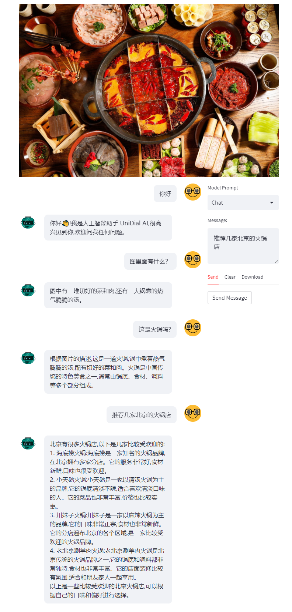

# MultiChat
MultiChat：开源多模态对话语言模型 | An open multimodal dialogue language model

## 介绍

MultiChat 是一个开源的、支持视觉（图片）的对话语言模型，具有约74亿参数，基于Blip2和ChatGLM-6B。目前MultiChat支持视觉和文本的对话，我们后续会开源支持视觉、文本、语音的多模态对话模型。

由于仅使用了4M左右的中文图文对进行模型训练，目前有较多局限性，包括MultiChat视觉感知能力及ChatGLM本身的局限性。

## 使用方式
使用 pip 安装依赖：`pip install -r requirements.txt`，其中 `transformers` 库版本推荐为 `4.26.1`，但理论上不低于 `4.23.1` 即可。

### 代码调用
```python
>>> from transformers import AutoProcessor, AutoModel
>>> processor = AutoProcessor.from_pretrained("phellonchen/multichat", trust_remote_code=True)
>>> model = AutoModel.from_pretrained("phellonchen/multicha", trust_remote_code=True).half().cuda()
>>> response, history = model.chat(processor, None, "你好", history=[])
>>> print(response)
你好👋!我是人工智能助手 MultiChat,很高兴见到你,欢迎问我任何问题。
>>> img_url = 'https://github.com/phellonchen/MultiChat/blob/main/images/chafing_dish.png' 
>>> raw_image = Image.open(requests.get(img_url, stream=True).raw).convert('RGB')
>>> question = "图里有什么？"
>>> history, output = model.chat(processor, raw_image, question, history)
图中有一堆切好的菜和肉,还有一大锅煮的热气腾腾的汤。
>>> question = "这是火锅吗?"
>>> history, output = model.chat(processor, raw_image, question, history)
根据图片的描述,这是一道火锅,锅中煮着热气腾腾的汤,配有切好的菜和肉。火锅是中国传统的特色美食之一,通常由锅底、食材、调料等多个部分组成。
>>> question = "推荐几家北京的火锅店"
>>> history, output = model.chat(processor, raw_image, question, history)
北京有很多火锅店,以下是几家比较受欢迎的
1.海底捞火锅:海底捞是一家知名的火锅品牌在北京拥有多家分店。它的服务非常好,食材新鲜,口味也很受欢迎。
2.小天鹅火锅:小天鹅是一家以清汤火锅为主的品牌,它的锅底清淡不辣,适合喜欢清淡口味的人。它的菜品也非常丰富,价格也比较实重。
3.川妹子火锅:川妹子是一家以麻辣火锅为主的品牌,它的口味非常正宗,食材也非常新鲜。它的分店遍布北京的各个区域,是一家比较受欢迎的火锅品牌。
4.老北京涮羊肉火锅:老北京涮羊肉火锅是北京传统的火锅品牌之一.它的锅底和调料都非常独特,食材也非常丰富。它的店面装修比较有氛围,适合和朋友家人一起享用。
以上是一些比较受欢迎的北京火锅店,可以根据自己的口味和偏好进行选择。
```

### Demo

我们提供了一个基于 [Gradio](https://gradio.app) 的网页版 Demo 、基于 [Streamlit](https://streamlit.io/)的网页版Demo。使用时首先需要下载本仓库：
```shell
git clone https://github.com/phellonchen/MultiChat.git
cd MultiChat
```

#### 网页版 Demo
<!--![web-demo]web-demo.png)-->


首先安装 Gradio：`pip install gradio`，Streamlit: `pip install streamlit steamlit-chat`
然后运行仓库中的 [multichat_gradio.py](multichat_gradio.py)或者[multichat_streamlit.py](multichat_streamlit.py)：

```
```shell
python multichat_gradio.py
```
或者
```shell
streamlit run multichat_streamlit.py
```

程序会运行一个 Web Server，并输出地址。在浏览器中打开输出的地址即可使用。

## MultiChat 示例


## 协议

本仓库的代码依照 [Apache-2.0](LICENSE) 协议开源，并使用了 ChatGLM-6B 模型的权重，相关使用则均需要遵循 [Model License](MODEL_LICENSE)。

## 单位
中国科学院自动化研究所 听觉模型与认知计算
